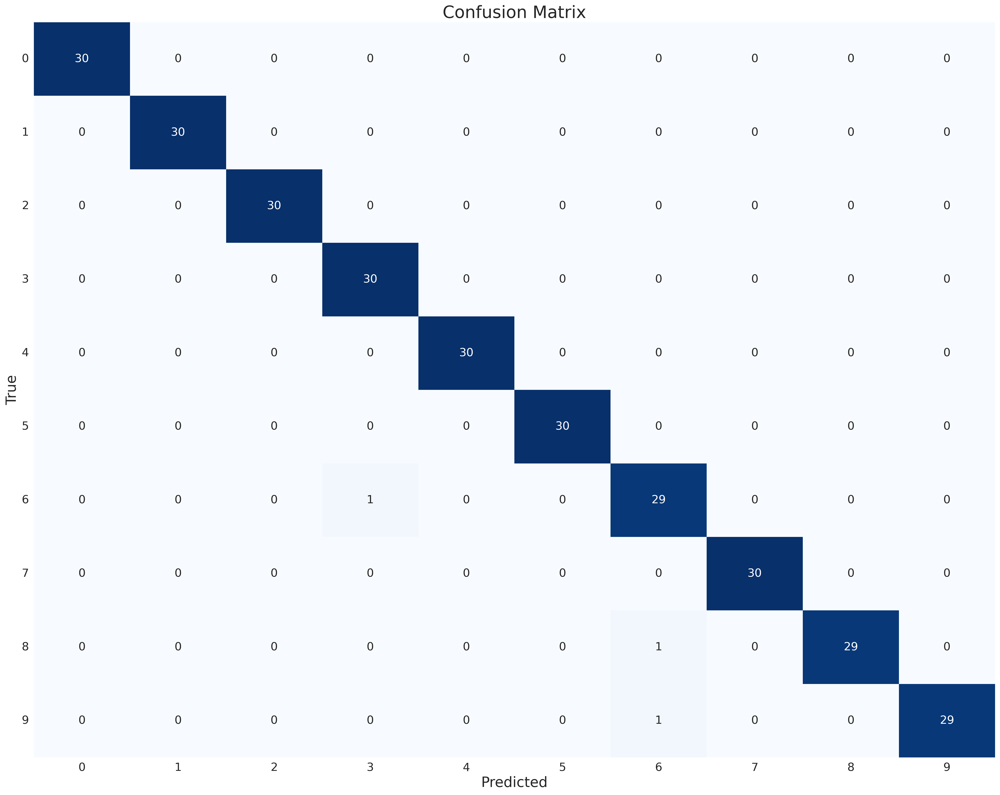

# Digit Classifier — MFCC + SVM (with live mic demo)

A lightweight prototype that listens to spoken digits (0–9) and predicts the correct number — fast, clean, and CPU‑friendly.

> **TL;DR**
> - **Approach:** MFCC (+Δ, ΔΔ) ➜ CMVN ➜ stats pooling ➜ SVM (RBF)
> - **Accuracy:** **99%** on test (speaker‑mixed split)
> - **Latency:** **~4.15 ms** feature + **~0.32 ms** inference per utterance (RTF ≈ **0.010**)
> - **Model size:** ~**2.3 MB** (full model ~**2.7 MB**) — CPU‑only
> - **Bonus:** Real‑time microphone script (`src/realtime.py`)

---

## What’s in the box
```
.
├── conda-requirements.txt
├── environment.yml
├── prompts/
│   └── gpt5_prompt.txt
└── src/
    ├── full_model.joblib
    ├── get_audio_data.py
    ├── get_features.py
    ├── main_trainer.py
    ├── model.joblib
    ├── plots/
    │   ├── confusion_matrix.png
    │   ├── spectrogram_0.png ... spectrogram_9.png
    │   ├── waveform_0.png    ... waveform_9.png
    ├── realtime.py
    └── utils.py
```

---

## Setup
Use the provided Conda env or plain pip. Hugging Face audio decoding uses **TorchCodec** + **FFmpeg**; the mic demo uses **PortAudio**.

### Option A — Conda (recommended)
```bash
conda env create -f environment.yml -n digit_classifier
conda activate digit_classifier
```

### Option B — Pip
```bash
pip install -r conda-requirements.txt   # or install the packages individually
# If needed on Linux
sudo apt-get update
sudo apt-get install -y ffmpeg portaudio19-dev
```

> If you see `ImportError: To support decoding audio data, please install 'torchcodec'`, run `pip install torchcodec` (and make sure FFmpeg is installed).

---

## How to run
From the repo root (or `cd src` first where noted):

### 1) Train + evaluate (saves `model.joblib` and plots)
```bash
cd src
python main_trainer.py
```
This will:
- Download & cache the **Free Spoken Digit Dataset** (`mteb/free-spoken-digit-dataset`, 8 kHz)
- Create a stratified **val** split from train (HF **test** used as-is)
- Extract MFCC(+Δ,+ΔΔ) ➜ CMVN ➜ stats pooling (144‑dim per utterance)
- Train an SVM (RBF) and report metrics
- Save `plots/confusion_matrix.png`
- Save `model.joblib` and also `full_model.joblib` (trained on all data for the live demo)

### 2) Real‑time microphone demo
```bash
cd src
python realtime.py --model full_model.joblib --seconds 1.0 --mic-sr 16000 --topk 3
```
Hit **ENTER** to record ~1s; the script trims silence, predicts, and prints top‑k with latency. If you need to choose a device:
```bash
python -c "import sounddevice as sd; print(sd.query_devices())"
python realtime.py --device <input_index>
```

---

## Approach (why this works)

```mermaid
graph LR
  A[Waveform (8 kHz)] --> B[MFCC 13 (drop c0)]
  B --> C[Δ & ΔΔ]
  C --> D[CMVN (train-only stats)]
  D --> E[Stats pooling (mean/std/min/max)]
  E --> F[SVM (RBF)]
  F --> G[Digit (0–9)]
```

- **Sampling:** 8 kHz mono (native FSDD). Window **25 ms**, hop **10 ms**.
- **Features:** 13 **MFCCs** with **c0 dropped** → 12; add **Δ** and **ΔΔ** → **36 dims/frame**.
- **Normalization:** **CMVN** fit on **train** frames only; applied to val/test.
- **Pooling:** mean, std, min, max across time → **144‑dim** vector per utterance.
- **Classifier:** scikit‑learn **SVM (RBF)** with a small `StandardScaler` after pooling.

This is tiny, fast, and accurate for digits, where most discriminative cues lie <4 kHz (Nyquist at 8 kHz).

---

## Results
All numbers come from the provided scripts on the standard HF splits (speaker‑mixed). Your hardware may vary slightly.

### Dataset summary
- Train/Val/Test sizes: **2430 / 270 / 300** (balanced: **≈243/27/30 per class**)
- Typical duration: ~**0.43 s** ± **0.14 s** (8 kHz)

### Metrics
- **Validation accuracy:** **100%** (270/270)
- **Test accuracy:** **99%** (297/300)

Confusion matrix:



### Latency & size
- **Feature calc:** **~4.15 ms/utt**
- **Inference:** **~0.32 ms/utt**
- **Real‑time factor:** **RTF ≈ 0.010** (end‑to‑end feature+inference vs audio length)
- **Model file:** `model.joblib` **~2.3 MB**; `full_model.joblib` **~2.7 MB**

> Note: These are CPU timings from the author’s laptop; they’ll be similar on typical machines.

---

## Evaluation criteria (how this submission addresses them)

**1) Modeling choices**  
Appropriate and efficient: MFCC(+Δ,+ΔΔ) at 8 kHz, CMVN, stats pooling, and a small SVM. Strong prior for short, isolated digits; low latency and tiny footprint.

**2) Model performance**  
Reported **accuracy** and per‑class **precision/recall/F1** via `classification_report`, plus a **confusion matrix**. Scores ~**99–100%** on the standard split.

**3) Responsiveness**  
Measured **feature** and **inference** time per utterance and **RTF**. The real‑time mic demo confirms near‑instant predictions.

**4) Code architecture**  
Modular: `get_audio_data.py` (data), `get_features.py` (features/CMVN), `main_trainer.py` (train/eval/save), `realtime.py` (mic), `utils.py` (plots, helpers). Easy to extend.

**5) LLM collaboration**  
Prompts and collaboration notes are in **`prompts/gpt5_prompt.txt`**. Collaboration shaped the pipeline, fixed decoding backend (TorchCodec/FFmpeg), added latency metrics, and built the mic demo script.

**6) Creative energy**  
Extras include waveform & spectrogram visuals (`src/plots/`), latency/RTF measurement, a **full‑data model** for better live performance, and a terminal mic UI with top‑k bars.

---

## Notes & limitations
- **Speaker overlap:** The HF train/val/test split is speaker‑mixed; results are an upper‑bound. A **speaker‑independent** split (grouped by speaker) is a good next step.
- **Robustness:** No data augmentation yet. Real‑world mic noise may reduce accuracy; see “Future work”.
- **Dependencies:** Audio decoding in 🤗 Datasets requires TorchCodec + FFmpeg; mic capture uses PortAudio.

---

## Future work
- **Speaker‑independent** evaluation (parse speaker IDs from filenames/paths).
- **Robustness** tests: background noise SNR sweeps, time shift, small speed/pitch perturbations.
- **VAD** (e.g., `webrtcvad`) to auto‑segment live speech.
- **Alternative baselines:** Whisper/faster‑whisper with text→digit mapping.
- **Tiny CNN** over log‑mels for end‑to‑end comparison; on‑device quantization.

---

## Acknowledgments
- Dataset: **Free Spoken Digit Dataset (FSDD)** via Hugging Face (`mteb/free-spoken-digit-dataset`).


